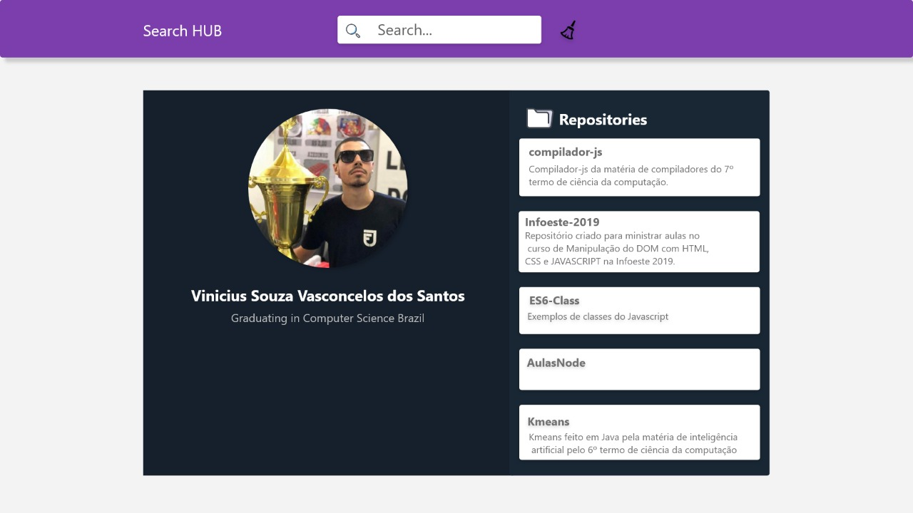

# Search Hub

#### Criado por [Murillo Wolf](https://github.com/MurilloWolf) e [Vinicius Vasconcelos](https://github.com/vinicius-vasconcelos)

 
 

**Search hub** é um projeto criado para aprender um pouco sobre HTML e CSS utilizando tags do HTML5, Variáveis CSS, Flex-box, deixando o projeto 100% responsivo, e com um bônus da biblioteca **Axios** (_JavaScript_).

A ideia principal do projeto é recriar a interface a baixo, fazendo com que ela faça uso da _API_ do github que busca informações sobre o usuário e seus repositórios:

> Modelo Desktop

> Modelo Mobile

## Padrão de cores

As cores utilizadas no projeto são:

- Primaria : #7c3ead
- Secundaria : #04ff79
- Background Dark : #16202c
- Background Dark2 : #313e50
- Titulo/Icone : #fff
- Descrição : #fff

> [Visualizar Paleta de Cores](https://coolors.co/04ff79-7c3ead-192734-16202c-313e50)

# AXIOS e API github

- Adicionar o [Axios](http://codeheaven.io/how-to-use-axios-as-your-http-client-pt/) pelo cdn ``

- Com o Axios vai ser feito uma requisição a API do github `https://api.github.com/users/${userName}/repos`
- `${userName}` é o nome que vai ser digitado no input para fazer a requisição na API

- O que foi usado de JavaScript ?
  - .getElementById('')
  - .innerHTML
  - .setAttribute
  - .insertAdjacentHTML
  - [.map()](https://developer.mozilla.org/pt-BR/docs/Web/JavaScript/Reference/Global_Objects/Array/map) ES6
  - [promise](https://developer.mozilla.org/pt-BR/docs/Web/JavaScript/Reference/Global_Objects/Promise) ES6

# Material

## Cursos Grátis

- [Curso Grátis de Variaveis CSS Scrimba](https://scrimba.com/g/gcssvariables) 13 Aulas
- [Curso Grátis de FlexBox Scrimba](https://scrimba.com/g/gflexbox) 9 Aulas

## Material Grátis

- [Explicação sobre a propriedade Display](https://www.maujor.com/tutorial/propriedade-css-display.php)
- [FlexBox ORIGAMID](https://origamid.com/projetos/flexbox-guia-completo/)
